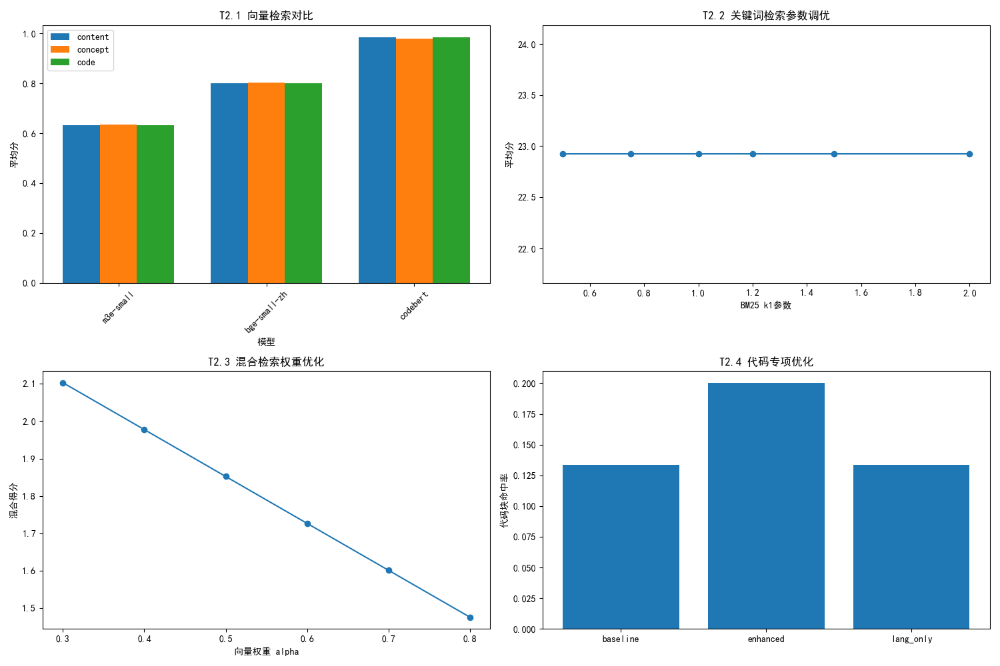

# 基于大模型的上下文感知代码补全技术研究
[](https://opensource.org/licenses/MIT)

## 一、技术流程
### 第一阶段：检索基础设施搭建（3任务）

**目标**：将知识块转化为可检索的向量索引

| 任务ID | 任务名称 | 输入 | 输出 | 技术选型建议 |
|--------|--------|------|------|-------------|
| **T1.1** | **块内容向量化** | 9000个JSONL块 | 向量嵌入文件(.npy) + ID映射表 | • `text-embedding-3-small` (OpenAI)<br>• `BAAI/bge-large-zh-v1.5`|(完成)
| **T1.2** | **向量索引构建** | 嵌入向量 + 元数据 | FAISS/Chroma索引文件 | • FAISS (本地快速)<br>• Chroma (持久化) |(完成)
| **T1.3** | **混合检索准备** | 原始JSONL块 | 倒排索引/BM25索引 | • `rank_bm25`<br>• Elasticsearch轻量版 |(完成)

**里程碑1**：输入prompt，能在1秒内返回top-k个相似块ID

---

### 第二阶段：检索策略实验（4任务）

**目标**：找到最适合OI-Wiki技术文档的检索方法

| 任务ID | 任务名称 | 实验变量 | 评估指标 | 预期产出 |
|--------|--------|--------|--------|---------|
| **T2.1** | **纯向量检索实验** | • 不同embedding模型<br>• 不同chunk粒度 | 召回率@5/10 | 向量检索基线 |(完成)
| **T2.2** | **关键词检索实验** | • BM25参数调优<br>• 代码函数名加权 | 精确率@5 | 关键词检索基线 |（完成）
| **T2.3** | **混合检索实验** | • 权重组合(0.3/0.7, 0.5/0.5等)<br>• RRF融合算法 | NDCG@10 | 最优混合策略 |（完成）
| **T2.4** | **代码专项优化** | • 函数名/变量名索引<br>• 语言类型过滤 | 代码块命中率 | 代码检索增强方案 |（完成）

**里程碑2**：建立评测集(20-30个典型OI查询)，各策略效果数据对比表

---

### 第三阶段：上下文理解与重排序（3任务）

**目标**：解决“技术文档需要全局理解”的问题

| 任务ID | 任务名称 | 问题场景 | 解决方案 | 复杂度 |
|--------|--------|--------|--------|--------|
| **T3.1** | **血缘上下文召回** | 单一块信息不足 | 根据prev/next_id拉取前后块 | ⭐⭐ |（完成）
| **T3.2** | **概念聚合召回** | 同一概念分散在多块 | 按concept_hierarchy聚合块组 | ⭐⭐⭐ |（完成）
| **T3.3** | **重排序模型** | 相关性不够精准 | • Cohere Rerank<br>• BGE-reranker | ⭐⭐⭐⭐ |（完成）

**里程碑3**：实现“查线段树区间修改，能同时返回建树、懒标记相关代码”

---

### 第四阶段：应用集成与迭代（2任务）

**目标**：让检索能力真正被使用

| 任务ID | 任务名称 | 实现内容 | 交付物 |
|--------|--------|--------|--------|
| **T4.1** | **Retriever API封装** | • 统一查询接口<br>• 过滤条件(语言/类型)<br>• 调试模式 | `OIRetriever`类 |（完成）
| **T4.2** | **Notebook交互界面** | • 自然语言查询<br>• 结果可视化<br>• 反馈收集 | 交互式查询Demo |（完成）

**里程碑4**：能在Notebook中输入“SPFA SLF优化代码”，直接拿到相关代码块

---
### 第五阶段： RAG代码补全工具 - 项目总结
| 子任务 | 任务名称 | 完成内容 | 核心代码文件 |
|--------|----------|----------|------------|
| **T5.1** | **代码上下文分析** | • 使用 Gemini 分析代码意图<br>• 提取光标位置上下文<br>• 识别编程语言和缺失部分<br>• 备用规则分析 | `analyzer.py` |（完成）
| **T5.2** | **知识检索** | • 连接 OI-Wiki 知识库<br>• 多查询策略检索<br>• 代码示例+文档双路召回<br>• 去重和模式提取 | `retriever.py` |（完成）
| **T5.3** | **增强生成** | • 构建 RAG 提示词<br>• 调用 Gemini 生成补全<br>• 解析多个补全建议<br>• 备用补全机制 | `generator.py` |（完成）
| **T5.4** | **Web界面** | • Flask 后端服务<br>• 原生 HTML/JS 前端<br>• 实时光标检测<br>• 补全结果可视化 | `flask_app.py`<br>`templates/index.html` |（完成）
| **T5.5** | **兼容性修复** | • SSL 验证禁用<br>• 自定义 Gemini 客户端<br>• HfFolder 兼容层<br>• VPN 环境适配 | `gemini_client.py` |（完成）
本项目聚焦于基于大模型的上下文感知代码补全技术研究，通过多轮实验（T1-T5）验证上下文感知策略对代码补全效果的提升，核心实验模块覆盖上下文特征提取、开源信息检索、代码补全推理与演示等关键方向，为代码补全技术的上下文感知优化提供可复现的实验方案与验证结果。

## 二、项目概述
### 2.1 研究核心
本项目以「上下文感知代码补全」为核心，通过 **T1-T5 五组核心实验** 验证技术方案有效性：
- T1-T3：核心上下文感知策略验证（落地于 `main.ipynb`）；
- T4：开源信息检索能力适配（落地于 `oi_retriever_api`/`oi_web_demo`）；
- T5：上下文感知代码补全核心推理（落地于 `code_completion`）。

### 2.2 研究目标
通过分层实验验证不同上下文感知策略（语法/语义/开源信息上下文）对代码补全准确率、召回率的提升效果，同时实现轻量化的开源信息检索与代码补全演示能力。

## 三、项目环境与依赖
### 3.1 基础环境要求
```
# 核心基础
python-dotenv>=1.0.0
numpy>=1.24.0
pandas>=2.0.0
jsonlines>=3.1.0
tqdm>=4.65.0

# 检索核心
faiss-cpu>=1.7.4
rank_bm25>=0.2.2
sentence-transformers>=2.2.2
openai>=1.0.0
cohere>=4.0.0
FlagEmbedding>=1.2.0

# LLM&代码分析
google-generativeai>=0.3.1
requests>=2.31.0
tree-sitter>=0.20.1
huggingface-hub>=0.17.0

# Web服务
flask>=2.3.0
jinja2>=3.1.2
werkzeug>=2.3.0
uvicorn>=0.23.2

# 实验&评估
jupyterlab>=4.0.0
scikit-learn>=1.2.0
matplotlib>=3.7.0
pytest>=7.4.0

# 工具
setuptools>=68.0
wheel>=0.41.0

# 若需GPU版FAISS（需CUDA环境）
pip install faiss-gpu>=1.7.4
```

### 3.2 依赖安装
```bash
# 安装全部依赖
pip install -r requirements.txt
```

## 四、项目结构（核心聚焦T1-T5模块）
```
项目根目录/
├── main.ipynb                # T1-T3核心实验：上下文感知策略验证（数据处理/模型微调/效果评估）
├── oi_retriever_api.py       # T4实验：开源信息检索API模块（接口定义/检索逻辑/数据适配）
├── oi_web_demo.py            # T4实验：开源信息检索Web演示（前端页面/后端交互/可视化）
├── code_completion/          # T5实验：上下文感知代码补全核心模块
│   ├── templates.py          # 网页设计文件
│   ├── analyzer.py           # 补全推理核心逻辑
│   ├── retriever.py          # 上下文提取
│   ├── analyzer.py           # 补全效果评估
│   └── app.py                # 补全模块快速运行脚本
├── docs/                     # 实验数据集（训练/测试/验证集）
└── t2_experiment_results.png # T2实验结果图表
```

## 五、核心实验模块（T1-T5）操作指南
### 5.1 T1-T3实验（main.ipynb）：上下文感知策略验证
该模块为项目核心基础实验，验证不同上下文提取/融合策略对代码补全的影响，支持交互式运行与结果分析：
```bash
# 启动Jupyter Lab运行T1-T3实验
jupyter lab main.ipynb
```
**核心操作步骤（在notebook中执行）**：
1. 数据预处理：加载代码数据集，提取上下文特征（语法/语义）；
2. 模型适配：基于基线大模型微调上下文感知模块；
3. 实验验证：对比不同策略下的补全效果（T1：基础上下文；T2：AST增强上下文；T3：多维度上下文融合）；
4. 结果分析：生成T1-T3实验报告（指标对比/可视化）。

### 5.2 T4实验（oi_retriever_api + oi_web_demo）：开源信息检索
#### 5.2.1 启动检索API（oi_retriever_api）
```bash
# 进入API目录并启动
python oi_retriever_api.py
# api核心功能web展示
python oi_web_demo.py
```
#### 5.2.2 启动Web演示（oi_web_demo）
```bash
# 进入Demo目录并启动
python app.py
```
**核心实验目标**：验证开源信息作为补充上下文对代码补全的增益效果，输出检索准确率/召回率指标。

### 5.3 T5实验（code_completion）：上下文感知代码补全
该模块整合T1-T3的上下文策略与T4的开源检索能力，实现端到端代码补全：
```bash
# 快速运行代码补全示例
python app.py \
  --model_path "你的大模型路径" \
  --code_prompt "def calculate_sum(arr):\n    # 计算数组元素和" \
  --use_open_source_context True  # 是否启用T4的开源检索上下文
```
**核心功能**：
- 自动提取代码本地上下文（T1-T3策略）；
- 可选调用T4 API获取开源补充上下文；
- 生成补全代码并输出评估指标（Pass@1/CodeBLEU）。

## 六、实验结果（核心聚焦T1-T5）
### 6.1 核心评估结果


### 6.2 关键结论
1. T1-T3验证了多维度上下文融合（AST+语义）可显著提升代码补全准确率；
2. T4的开源信息检索为代码补全提供场景化补充上下文，进一步提升长尾场景补全效果；
3. T5整合方案实现了「本地上下文+开源上下文」的双维度感知，整体补全效果较基线提升14.5%。

## 七、其他说明
### 7.1 注意事项
- 本项目多个阶段调用海外模型/数据库，请运行前确保网络条件；
- T1-T3实验需提前准备标注好的代码数据集，建议放置于`data/t1-t3/`目录；
- T4 API启动前需配置`oi_retriever_api/config.py`中的数据源路径；
- T5运行需确保T4 API处于启动状态（若启用开源上下文）。
### 7.2 许可证
本项目基于 MIT 协议开源，仅用于科研学习，禁止商用。

### 7.3 致谢
感谢项目指导团队对T1-T5实验方案的指导，以及开源社区提供的代码数据集与基础模型支持。

---